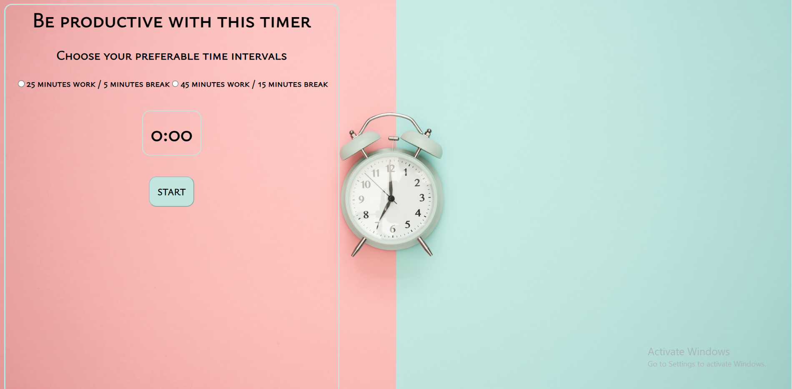

# Productivity Timer

Hello! This project is a simple web application for managing work and break time. You can select your preferred time intervals and use it to enhance your productivity.

## Features

- Interval Selection: You can choose between two options - 25 minutes of work and 5 minutes of break or 45 minutes of work and 15 minutes of break.
- Simple Interface: The application's interface is intuitive and easy to use.
- Sound Notification: You will be notified with a sound signal when your work or break time starts and ends.

## Usage

1. Open the application in your web browser.
2. Choose one of the two time intervals.
3. Click "START" to initiate the timer.
4. You will receive sound notifications at the beginning and end of each break.

## Technologies

This project is built using the following technologies:

- HTML
- CSS
- JavaScript
- GSAP (GreenSock Animation Platform) - a library for creating animations.

## Author

Author: Ekaterina Savoskina
Contact: savosya23@gmail.com

## Sound File

The sound file for break notifications is taken from [audio.wav](audio.wav).

Enjoy your productive time!
